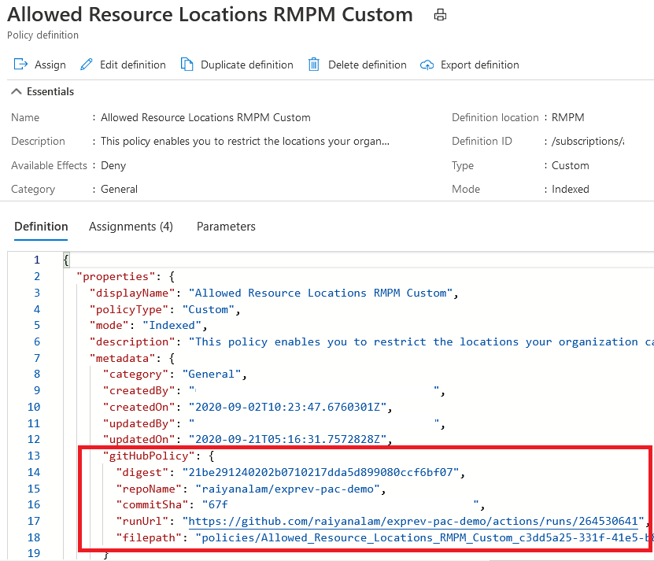

# Managing Azure Policy as Code with GitHub

As you progress on the journey of Cloud Governance, there is an increasing need to shift from manually managing each policy in Azure portal to something more manageable, collaborative and repeatable at enterprise scale.  We are excited to announce that we are rolling out experience that will help you manage Azure policy from GitHub and provide you all the benfits of a version control. 

With these new features:
- You can easily export existing policies from Azure portal and store them as files in GitHub repository
- You can collaborate in GitHub with other stakeholders to create or modify policy files, track all the changes done and push all updates back to Azure using GitHub actions
- You can now employ safe deployment practices by rolling out policies in a stagewise and orchestrated manner using GitHub workflows
- You can also trigger compliance scans at one or more multiple scopes at a pre-defined convenient time and get report in form of a csv file which can be used for further analysis or archival 


### Export Policies from Azure Portal


   > **NOTE:**
   > This feature is under a **private preview** and you can access this using [this URL](https://aka.ms/exportpolicy).

To export azure policy from Azure portal, follow these steps:

1. Launch the Azure Policy service in the Azure portal by clicking **All services**, then searching
   for and selecting **Policy**.

1. Select **Definitions** on the left side of the Azure Policy page.

1. Use the **Export definitions** button or select the ellipsis on the row of a policy definition
   and then select **Export definition**.

    

1. Select the **Sign in with GitHub** button. If you are not already logged into your github account in the browser, a window will prompt you to sign in.  Provide your GitHub account details and click Sign in. The window self-closes once signed in.

1. On the **Basics** tab, set the following options, then select the **Policies** tab or **Next :
   Policies** button at the bottom of the page.

   

   - **Repository filter**: Set to _My repositories_ to see only repositories you own or _All
     repositories_ to see all you granted the GitHub Action access to.
   - **Repository**: Set to the repository that you want to export the Azure Policy resources to.
   - **Branch**: Set the branch in the repository. Using a branch other than the default is a good
     way to validate your updates before merging further into your source code.
   - **Directory**: The _root level folder_ to export the Azure Policy resources to. Subfolders
     under this directory are created based on what resources are exported.
    

1. On the **Policies** tab, set the scope to search by selecting the ellipsis and picking a
   combination of management groups, subscriptions, or resource groups. 
   
1. Use the **Add policy definition(s)** button to search the scope for which policy to export. In
   the side window that opens, select each policy to export. Filter the selection by the search box
   or the type. Once you've selected all objects to export, use the **Add** button at the bottom of
   the page.

1. For each selected policy, select the desired export options such as _Only Definition_ or
   _Definition and Assignment(s)_ for a policy definition. Then select the **Review + Export** tab
   or **Next : Review + Export** button at the bottom of the page.

   > **NOTE:**
   > If option _Definition and Assignment(s)_ is chosen, only policy assignments within the scope
   > set by the filter when the policy definition is added are exported.

    

1. On the **Review + Export** tab, check the details match and then use the **Export** button at the
   bottom of the page.

1. Check your GitHub repo, branch, and _root level folder_ to see that the selected resources are
   now exported to your source control.

   

The Azure Policy resources are exported into the following structure within the selected GitHub
repository and _root level folder_:

```text
|
|- <root level folder>/  ________________ # Root level folder set by Directory property
|  |- policies/  ________________________ # Subfolder for policy objects
|     |- <displayName>_<name>____________ # Subfolder based on policy displayName and name properties
|        |- policy.json _________________ # Policy definition
|        |- assign.<displayName>_<name>__ # Each assignment (if selected) based on displayName and name properties
|
```


### Push updates in GitHub Repo policy files to Azure

1. When you export policies, along with the policy resources, a [GitHub workflow](https://docs.github.com/en/actions/configuring-and-managing-workflows/configuring-a-workflow#about-workflows) file  .github/workflows/manage-azure-policy-\<randomLetters\>.yml  is also created to get you started easily

    


2. This workflow file uses [Manage Azure Policy](https://github.com/marketplace/actions/manage-azure-policy) action to push any changes made to the exported policy resources in GitHub repository to Azure policy. By default, the action will consider only those files that are different from the ones existing in Azure and sync changes for these files only. You can also use the `assignments` parameter in the action to only sync changes done to specific assignment files only. This can be used to apply policies only for a specific environment. For more details check out the [repository](https://github.com/Azure/manage-azure-policy).

3. By default the workflow is configured to be triggered manually at the push of a button. You can do so by visiting the Actions section in Github and clicking on the workflow.

    

4. The workflow will sync the changes done to policy files with Azure and give you the status in the logs.
    

5. The workflow will also add details in the policy for you to track back changes to a github run.
    


### Trigger compliance scans using GitHub action

Using the [Azure Policy Compliance Scan action](https://github.com/marketplace/actions/azure-policy-compliance-scan) you can trigger an on-demand compliance evaluation scan from your [GitHub workflow](https://docs.github.com/en/actions/configuring-and-managing-workflows/configuring-a-workflow#about-workflows) on one or multiple resources, resource groups or subscriptions, and continue/fail the workflow based on the compliance state of resources. You can also  configure the workflow to run at a scheduled time so that you get the latest compliance status at a convenient time. Optionally, this Github action can also generate a report on the compliance state of scanned resources for further analysis or for archiving.

The following example will run compliance scan for a subscription. 

```yaml

on:
  schedule:    
    - cron:  '0 8 * * *'  # runs every morning 8am
jobs:
  assess-policy-compliance:    
    runs-on: ubuntu-latest
    steps:         
    - name: Login to Azure
      uses: azure/login@v1
      with:
        creds: ${{secrets.AZURE_CREDENTIALS}} 

    
    - name: Check for resource compliance
      uses: azure/policy-compliance-scan@v0
      with:
        scopes: |
          /subscriptions/xxxxxxxx-xxxx-xxxx-xxxx-xxxxxxxxxxxx

```
